+++
author = "Tristan Trouwen"
title = "Deep Dive: Anthropic's Performance Take-Home (The One Claude Beat Humans At)"
slug = "anthropic-performance-takehome"
date = "2026-01-21"
description = "A detailed breakdown of Anthropic's original performance take-home test - the one Claude Opus 4.5 beat most humans at. We'll explore the custom VLIW SIMD architecture simulator, the tree traversal problem, and why this challenge is so fascinating."
mermaid = true
tags = [
    "performance",
    "compilers",
    "SIMD",
    "VLIW",
    "optimization",
    "AI",
]
categories = [
    "tutorials",
]
+++

Today, Anthropic [open-sourced their original performance engineering take-home](https://github.com/anthropics/original_performance_takehome). The task: optimize a kernel running on a custom [VLIW](https://en.wikipedia.org/wiki/Very_long_instruction_word) [SIMD](https://en.wikipedia.org/wiki/Single_instruction,_multiple_data) processor simulator. The baseline takes **147,734 cycles**. Claude Opus 4.5 got it down to **1,487 cycles** - a 99x speedup that beat most humans.

I'm [Tristan](https://github.com/trirpi) ([@trirpi](https://twitter.com/trirpi)), and I work on AI kernels. Let's break down how this whole system works.

---

## The Architecture at a Glance

Here's what we're dealing with:

```mermaid
flowchart TB
    subgraph cycle["⚡ Single Cycle Execution"]
        direction LR
        ALU["<b>ALU</b><br/>12 slots"]
        VALU["<b>VALU</b><br/>6 slots<br/>(VLEN=8)"]
        LOAD["<b>LOAD</b><br/>2 slots"]
        STORE["<b>STORE</b><br/>2 slots"]
        FLOW["<b>FLOW</b><br/>1 slot"]
    end
    
    subgraph scratch["📦 Scratch Space (1536 words)"]
        REG["registers + constants + cache"]
    end
    
    subgraph mem["💾 Main Memory"]
        direction LR
        HEADER["Header<br/>(7 words)"]
        TREE["Tree Values<br/>(2047 words)"]
        IDX["Indices<br/>(256 words)"]
        VAL["Values<br/>(256 words)"]
    end
    
    cycle --> scratch
    scratch <--> mem
```



The key insight: **multiple engines execute in parallel each cycle**. In a single clock cycle, you can run:
- 12 scalar ALU ops
- 6 vector ALU ops (each processing 8 elements)
- 2 loads + 2 stores
- 1 flow control op

That's the VLIW part. The challenge is actually *using* all that parallelism.

---

## The Execution Engines

The processor has multiple **engines**, each capable of executing multiple **slots** per cycle. From [`problem.py`](https://github.com/anthropics/original_performance_takehome/blob/main/problem.py#L48-L55):

```python
SLOT_LIMITS = {
    "alu": 12,      # 12 scalar ALU operations per cycle
    "valu": 6,      # 6 vector ALU operations per cycle
    "load": 2,      # 2 load operations per cycle
    "store": 2,     # 2 store operations per cycle
    "flow": 1,      # 1 flow control operation per cycle
    "debug": 64,    # Debug operations (not counted)
}
```

### What an Instruction Bundle Looks Like

```mermaid
flowchart LR
    subgraph bundle["📦 Instruction Bundle (1 clock cycle)"]
        subgraph compute["Compute"]
            ALU["<b>alu:</b><br/>('+', dest, a, b)<br/>('-', dest, a, b)<br/>('*', dest, a, b)<br/><i>...up to 12</i>"]
            VALU["<b>valu:</b><br/>('*', vdest, va, vb)<br/>('+', vdest, va, vb)<br/><i>...up to 6</i>"]
        end
        subgraph memory["Memory"]
            LOAD["<b>load:</b><br/>('load', dest, addr)<br/>('vload', vdest, addr)"]
            STORE["<b>store:</b><br/>('store', addr, src)<br/>('vstore', addr, vsrc)"]
        end
        subgraph control["Control"]
            FLOW["<b>flow:</b><br/>('select', d, c, a, b)"]
            DEBUG["<b>debug:</b><br/>('compare', loc, key)<br/><i>(not counted)</i>"]
        end
    end
```



An instruction is a Python dict mapping engine names to lists of operations. Here's a [real example](https://github.com/anthropics/original_performance_takehome/blob/main/problem.py#L86-L87):

```python
{"valu": [("*", 4, 0, 0), ("+", 8, 4, 0)], "load": [("load", 16, 17)]}
```

This executes **three operations in one cycle**:
1. Vector multiply: `scratch[4:12] = scratch[0:8] * scratch[0:8]`
2. Vector add: `scratch[8:16] = scratch[4:12] + scratch[0:8]`
3. Scalar load: `scratch[16] = memory[scratch[17]]`

---

## The Problem: Batched Tree Traversal

The kernel implements a batched tree traversal with hashing. Here's the flow:


From the [reference kernel](https://github.com/anthropics/original_performance_takehome/blob/main/problem.py#L467-L484):

```python
def reference_kernel(t: Tree, inp: Input):
    """
    A parallel tree traversal where at each node we set
    cur_inp_val = myhash(cur_inp_val ^ node_val)
    and then choose the left branch if cur_inp_val is even.
    If we reach the bottom of the tree we wrap around to the top.
    """
    for h in range(inp.rounds):
        for i in range(len(inp.indices)):
            idx = inp.indices[i]
            val = inp.values[i]
            val = myhash(val ^ t.values[idx])
            idx = 2 * idx + (1 if val % 2 == 0 else 2)
            idx = 0 if idx >= len(t.values) else idx
            inp.values[i] = val
            inp.indices[i] = idx
```

Test configuration:
- **Tree height**: 10 (2047 nodes in a [perfect binary tree](https://www.programiz.com/dsa/perfect-binary-tree))
- **Batch size**: 256 items processed
- **Rounds**: 16 iterations

That's `256 × 16 = 4096` traversal steps, each involving a hash computation.

### The Hash Function

```mermaid
flowchart TD
    IN(["🔢 Input: a"]) --> S0
    S0["Stage 0: a = (a + 0x7ED55D16) + (a << 12)"] --> S1
    S1["Stage 1: a = (a ^ 0xC761C23C) ^ (a >> 19)"] --> S2
    S2["Stage 2: a = (a + 0x165667B1) + (a << 5)"] --> S3
    S3["Stage 3: a = (a + 0xD3A2646C) ^ (a << 9)"] --> S4
    S4["Stage 4: a = (a + 0xFD7046C5) + (a << 3)"] --> S5
    S5["Stage 5: a = (a ^ 0xB55A4F09) ^ (a >> 16)"] --> OUT
    OUT(["🎯 Output hash"])
```



Each stage = 3 ALU ops: `tmp1 = a op1 const`, `tmp2 = a op3 shift`, `a = tmp1 op2 tmp2`

**Total: 6 stages × 3 ops = 18 ALU operations per hash**

The hash is defined [data-driven](https://github.com/anthropics/original_performance_takehome/blob/main/problem.py#L439-L464) for easy kernel implementation:

```python
HASH_STAGES = [
    ("+", 0x7ED55D16, "+", "<<", 12),
    ("^", 0xC761C23C, "^", ">>", 19),
    ("+", 0x165667B1, "+", "<<", 5),
    ("+", 0xD3A2646C, "^", "<<", 9),
    ("+", 0xFD7046C5, "+", "<<", 3),
    ("^", 0xB55A4F09, "^", ">>", 16),
]
```

Similar to [Bob Jenkins' hash](https://en.wikipedia.org/wiki/Jenkins_hash_function). Each stage: `a = (a op1 val1) op2 (a op3 val3)`

---

## The Memory Model

Two memory spaces:

1. **Main Memory** (`self.mem`): Problem input/output
2. **Scratch Space** (`core.scratch`): 1536 words - think of it as registers + constant memory + manually managed cache

From the [constants](https://github.com/anthropics/original_performance_takehome/blob/main/problem.py#L57-L60):

```python
VLEN = 8          # Vector length: 8 elements
N_CORES = 1       # Single core (older versions had multiple)
SCRATCH_SIZE = 1536  # 1536 words of scratch space
```

Every ALU operation reads and writes scratch addresses. It's like programming a [GPU with shared memory](https://developer.nvidia.com/blog/using-shared-memory-cuda-cc/), but more explicit.

---

## The ALU Operations

[Scalar ALU ops](https://github.com/anthropics/original_performance_takehome/blob/main/problem.py#L219-L252):

```python
def alu(self, core, op, dest, a1, a2):
    a1 = core.scratch[a1]
    a2 = core.scratch[a2]
    match op:
        case "+":  res = a1 + a2
        case "-":  res = a1 - a2
        case "*":  res = a1 * a2
        case "//": res = a1 // a2
        case "^":  res = a1 ^ a2       # XOR
        case "&":  res = a1 & a2       # AND
        case "|":  res = a1 | a2       # OR
        case "<<": res = a1 << a2      # Left shift
        case ">>": res = a1 >> a2      # Right shift
        case "%":  res = a1 % a2       # Modulo
        case "<":  res = int(a1 < a2)  # Comparison
        case "==": res = int(a1 == a2)
    res = res % (2**32)  # 32-bit unsigned wrap
    self.scratch_write[dest] = res
```

[Vector ALU ops](https://github.com/anthropics/original_performance_takehome/blob/main/problem.py#L254-L267) - the SIMD part:

```python
def valu(self, core, *slot):
    match slot:
        case ("vbroadcast", dest, src):
            # Broadcast scalar to all 8 vector lanes
            for i in range(VLEN):
                self.scratch_write[dest + i] = core.scratch[src]
        case ("multiply_add", dest, a, b, c):
            # Fused multiply-add: dest = a * b + c
            for i in range(VLEN):
                mul = (core.scratch[a + i] * core.scratch[b + i]) % (2**32)
                self.scratch_write[dest + i] = (mul + core.scratch[c + i]) % (2**32)
        case (op, dest, a1, a2):
            # Any scalar op applied element-wise
            for i in range(VLEN):
                self.alu(core, op, dest + i, a1 + i, a2 + i)
```

---

## Memory Operations

[Load/store](https://github.com/anthropics/original_performance_takehome/blob/main/problem.py#L269-L298) - only 2 of each per cycle:

```python
def load(self, core, *slot):
    match slot:
        case ("load", dest, addr):
            self.scratch_write[dest] = self.mem[core.scratch[addr]]
        case ("vload", dest, addr):  # 8 consecutive elements
            addr = core.scratch[addr]
            for vi in range(VLEN):
                self.scratch_write[dest + vi] = self.mem[addr + vi]
        case ("const", dest, val):
            self.scratch_write[dest] = (val) % (2**32)
```

Key bottleneck: **only 2 loads per cycle**. Vector loads (`vload`) help - 8 elements in one slot!

---

## Flow Control

[Flow ops](https://github.com/anthropics/original_performance_takehome/blob/main/problem.py#L300-L335) - crucial for [branchless programming](https://en.algorithmica.org/hpc/pipelining/branchless/):

```python
def flow(self, core, *slot):
    match slot:
        case ("select", dest, cond, a, b):
            # Branchless: dest = cond ? a : b
            self.scratch_write[dest] = (
                core.scratch[a] if core.scratch[cond] != 0 else core.scratch[b]
            )
        case ("vselect", dest, cond, a, b):
            # Vector version
            for vi in range(VLEN):
                self.scratch_write[dest + vi] = (
                    core.scratch[a + vi]
                    if core.scratch[cond + vi] != 0
                    else core.scratch[b + vi]
                )
        case ("cond_jump", cond, addr):
            if core.scratch[cond] != 0:
                core.pc = addr
        case ("jump", addr):
            core.pc = addr
```

---

## Why the Baseline Is So Slow

The [baseline kernel](https://github.com/anthropics/original_performance_takehome/blob/main/perf_takehome.py#L88-L175) deliberately uses **one operation per cycle**:

```python
def build(self, slots: list[tuple[Engine, tuple]], vliw: bool = False):
    # Simple slot packing that just uses one slot per instruction bundle
    instrs = []
    for engine, slot in slots:
        instrs.append({engine: [slot]})  # One op per bundle!
    return instrs
```

So instead of:
```python
{"alu": [op1, op2, op3], "load": [load1]}  # 1 cycle
```

You get:
```python
{"alu": [op1]}    # Cycle 1
{"alu": [op2]}    # Cycle 2
{"alu": [op3]}    # Cycle 3
{"load": [load1]} # Cycle 4
```

4 cycles instead of 1. The 12 ALU slots sit empty.

---

## Debugging Tools

### Perfetto Trace Viewer

The simulator outputs [Chrome Trace Event Format](https://docs.google.com/document/d/1CvAClvFfyA5R-PhYUmn5OOQtYMH4h6I0nSsKchNAySU/preview) traces viewable in [Perfetto](https://ui.perfetto.dev/):

```bash
python perf_takehome.py Tests.test_kernel_trace
python watch_trace.py  # Opens browser with live-reloading trace
```

The [`watch_trace.py`](https://github.com/anthropics/original_performance_takehome/blob/main/watch_trace.py) server auto-reloads traces when they change - great for iterating.

### Debug Instructions

[Debug ops](https://github.com/anthropics/original_performance_takehome/blob/main/problem.py#L365-L382) verify intermediate values without counting cycles:

```python
body.append(("debug", ("compare", tmp_val, (round, i, "hashed_val"))))
```

---

## Optimization Strategies

The key techniques:

### 1. VLIW Packing
Pack independent operations into the same cycle:
```python
{"alu": [op1, op2, op3], "load": [load1, load2]}  # 5 ops, 1 cycle
```

### 2. SIMD Vectorization  
Process 8 batch items at once with `valu` and `vload`/`vstore`.

### 3. [Software Pipelining](https://en.wikipedia.org/wiki/Software_pipelining)
Overlap computation of different iterations to keep all engines busy.

### 4. Branchless with `select`
```python
# Instead of conditional jumps:
offset = select(val % 2 == 0, 1, 2)
idx = 2*idx + offset
```

### The Hard Part: Data Dependencies

You can't compute the next tree index until you've hashed the current value. That's a serial [dependency chain](https://en.wikipedia.org/wiki/Instruction-level_parallelism#Data_dependency). The trick is finding parallelism *across* different batch items.

---

## Try It Yourself

```bash
git clone https://github.com/anthropics/original_performance_takehome.git
cd original_performance_takehome
python perf_takehome.py Tests.test_kernel_cycles
```

Output:
```
forest_height=10, rounds=16, batch_size=256
CYCLES:  147734
Speedup over baseline:  1.0
```

Beat Claude's 1,487 cycles? Email performance-recruiting@anthropic.com - they're hiring!

---

## Further Reading

- [VLIW Architecture - Wikipedia](https://en.wikipedia.org/wiki/Very_long_instruction_word)
- [SIMD Programming - Intel Intrinsics Guide](https://www.intel.com/content/www/us/en/docs/intrinsics-guide/index.html)
- [Software Pipelining - Wikipedia](https://en.wikipedia.org/wiki/Software_pipelining)
- [Perfetto UI](https://ui.perfetto.dev/)
- [Chrome Trace Event Format](https://docs.google.com/document/d/1CvAClvFfyA5R-PhYUmn5OOQtYMH4h6I0nSsKchNAySU/preview)
- [Computer Architecture: A Quantitative Approach](https://www.amazon.com/Computer-Architecture-Quantitative-Approach-Kaufmann/dp/0128119055)
- [Branchless Programming](https://en.algorithmica.org/hpc/pipelining/branchless/)

---

*Found this useful? Follow me on [Twitter/X](https://twitter.com/trirpi) or [GitHub](https://github.com/trirpi).*
